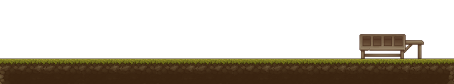

<link href='https://fonts.googleapis.com/css?family=VT323' rel='stylesheet'>


<h1 style="font-family:VT323">Hello there 👋 I'm Cauã, a brazilian developer</h1>
 


<!--START_SECTION:waka-->

<br><br><br><br><br><br><br><br><br><br>
**This Week Time:** 

```text
💬 Programming Languages: 
No Activity Tracked This Week

💻 Operating System: 
No Activity Tracked This Week

```
<!--END_SECTION:waka-->



